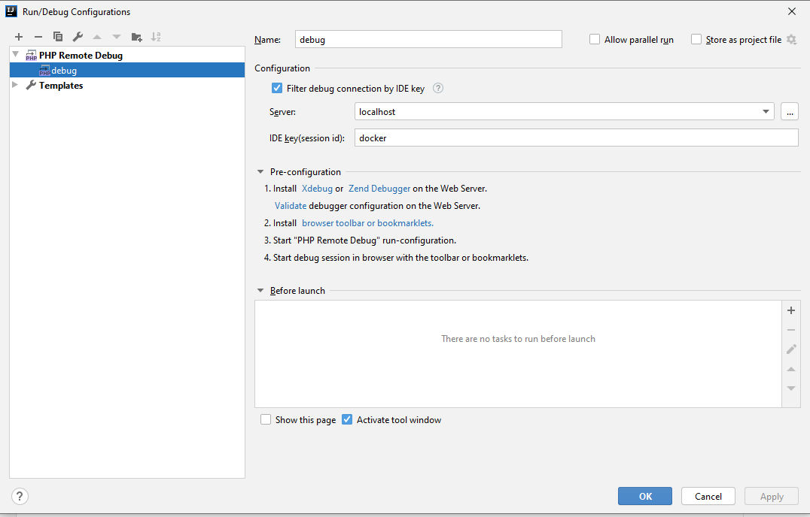
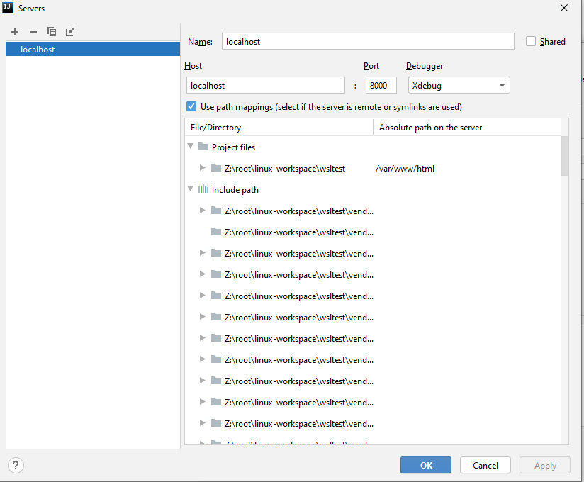
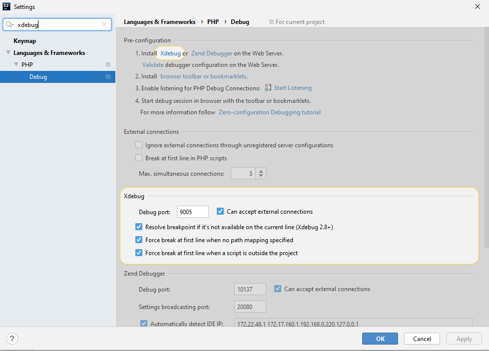
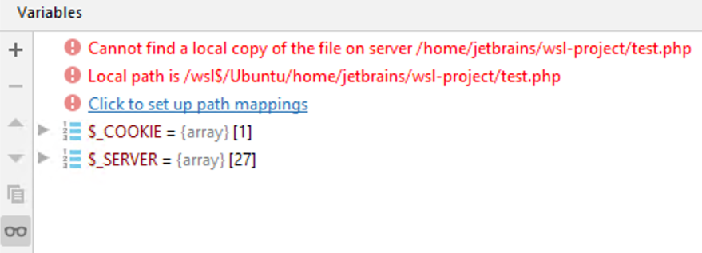
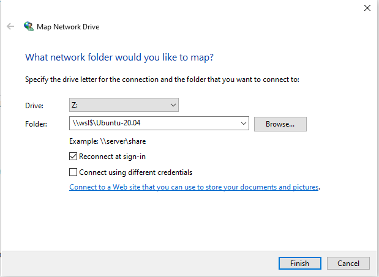

With the release of [Docker Desktop WSL 2 Backend](https://docs.docker.com/docker-for-windows/wsl/), you can greatly improve the [performance](https://microhobby.com.br/blog/2019/09/25/comparing-performance-ubuntu-18-04-wsl-wsl-2-docker-desktop/) of your projects. You can run them with **near Linux-like performance** even on Windows, which is a big deal and it solves many of the problems of running Docker on Windows. One of the common problems with Docker on Windows used to be that Windows Home could not run Hyper-V. You needed at least Windows Pro license. With WSL 2, you can enjoy all the benefits even on Windows Home. There were also many other problems like poor IO performance through Samba protocol or missing mapping for some system calls like `inotify`.

I wanted to try out WSL 2 to see the difference in one of my PHP projects. My goal was simple, I wanted to run the project inside Docker and be able to debug it remotely with Xdebug in IntelliJ. But there were some hurdles along the way that I had to overcome. That's why I have decided to write this article to share what have I learned when playing with WSL 2 so you don't have to figure out things all by yourself.

Prerequisites are that you have WSL 2 with your favorite Linux distribution installed. It is pretty straight forward, you can follow the instructions [here](https://docs.microsoft.com/en-us/windows/wsl/install-win10). As an example project, I will use the [demo Symfony project](https://github.com/symfony/demo) with some modifications, but you can use any project you want. If you want to just test it out and don't want to use your own project, you can use my modified demo project on my [Github](https://github.com/tomasbruckner/xdebug-wsl2-demo). Next, you need to switch your Docker Desktop to use WSL 2 Backend. You can follow the instructions [here](https://docs.docker.com/docker-for-windows/wsl/). Again, everything is pretty straight forward.

**Hurdle #1** One thing that made sense but was confusing at first was that after you switch Docker backend to WSL 2, you won't be able to access your images, volumes, and containers, etc. from the standard engine. If you are serious about switching, I recommend you to [prune](https://docs.docker.com/config/pruning/) unused Docker objects. You can reclaim 10s to 100s of GBs of memory that you won't be able to use anyway after switching to WSL 2 Backend.

**Hurdle #2** The important part is that you need to have the source files inside WSL 2 filesystem!! This is described in the [Docker best practices](https://docs.docker.com/docker-for-windows/wsl/#best-practices). Having the file on the Windows filesystem will be actually [slower than WSL 1](https://github.com/microsoft/WSL/issues/4197).

After installing the project, you can open the project in IntelliJ using `\\wsl$` path. Now you need to configure IntelliJ to enable Xdebug support. Set your *Run configuration* as follows



IDE key (session id) value depends on your `xdebug.ini` file (see mine below). The server should be configured something like this



Don't forget to add path mappings and set Absolute path on the server to `/var/www/html`.

For debugging, I am using custom port 9005 defined in `xdebug.ini` so I have to change settings for IntelliJ like this



My custom `xdebug.ini` can be found [here](https://github.com/tomasbruckner/xdebug-wsl2-demo/blob/master/docker/php/xdebug.ini). It is basically

```ini
xdebug.remote_enable=1
xdebug.remote_handler=dbgp
xdebug.remote_port=9005
xdebug.remote_autostart=1
xdebug.remote_connect_back=0
xdebug.idekey=docker
```

You might be wondering, why is there no **xdebug.remote_host**. This brings us to

**Hurdle #3** WSL 2 changes the IP address of Windows host every time you restart your PC (most likely). You can find this IP in your Linux distro like so

```bash
$ cat /etc/resolv.conf
# This file was automatically generated by WSL. To stop automatic generation of this file, add the following entry to /etc/wsl.conf:
# [network]
# generateResolvConf = false
nameserver 172.22.48.1
```

Problem is, that if you defined this IP address in your Xdebug configuration, it might not work the second time you try to run the project. That's why you need to define it dynamically. You can solve this issue in many different ways from changing the remote_host every time it changes manually to update it using the script. I have chosen to use the environment variable when starting my Docker Compose and changing the entry point for Apache.

In the [entry point](https://github.com/tomasbruckner/xdebug-wsl2-demo/blob/master/docker/php/docker-php-entrypoint-modified), I use sed to remove the remote_host line and echo to append new remote_host from the **WSLIP** environment variable defined in [docker-compose.yml](https://github.com/tomasbruckner/xdebug-wsl2-demo/blob/master/docker-compose.yml). To start the project, I just run:

```bash
WSLIP=$(grep nameserver /etc/resolv.conf  | cut -d ' ' -f2) docker-compose up
```

**Hurdle #4** Even when you start debugging, breakpoints are never hit. That's because Windows Defender Firewall treats WSL as a public network by default and [blocks access](https://github.com/microsoft/WSL/issues/4139). You can configure your firewall using PowerShell to add allow a rule to fix this issue. Just run

```powershell
New-NetFirewallRule -DisplayName "WSL" -Direction Inbound  -InterfaceAlias "vEthernet (WSL)"  -Action Allow
```

For an explanation see this [issue](https://github.com/microsoft/WSL/issues/4585#issuecomment-610061194).

You might also wonder why you need to access Windows host from WSL 2? That's because that's how remote debugging in Xdebug works. Checkout [Communication Set-up](https://xdebug.org/docs/remote) in Xdebug documentation.

**Hurdle #5** When you go to [http://localhost:8000/en/blog](http://localhost:8000/en/blog/) (if you are using my project) and have a breakpoint in **BlogController.php** in method **index**, you will see the following error in the IDE (with slightly different paths)



This is a bug in the IntelliJ tracked [here](https://youtrack.jetbrains.com/issue/WI-51813). For a workaround, you need to map `\\wsl$` mount to a network drive. Just right click on **This PC** in Windows and select **Map Network Drive…** and fill it similar to this



Values depend on your Linux distribution and for Drive letter you can choose anything you want. After you have mapped WSL to a network drive, open your project in IntelliJ using this new network drive, and start debugging.

Congratulations, everything should for now! Even though it took some time to make Xdebug work as I needed, for me it was definitely worth the effort. Performance is 5–10 times better for my projects and I can highly recommend it. Hopefully, I don't encounter any more hurdles in the future with WSL 2 and Docker, but if I do, I will update this article. If you have different problems and you want to share your solution, let me know in the comment section.
