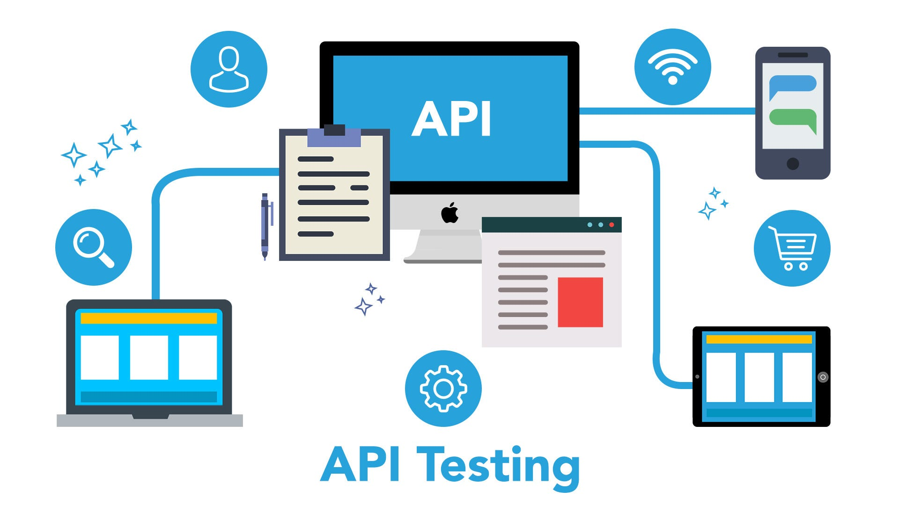
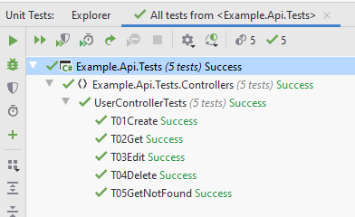
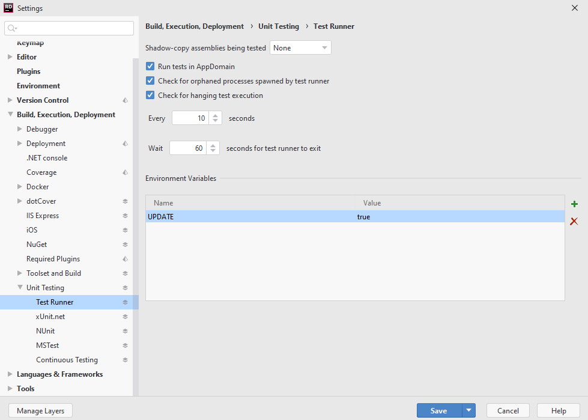

When I first started playing with API testing in .NET Core 3, I wanted to have a quick In Memory API test that takes snapshots. In this article, I am going to describe a way how to do it easily so even you can do it in your project. If you are not familiar with the snapshot testing and why you should care, it will be explained below.

## WebApplicationFactory Class

This is the core of your API testing. Here, you can replace your services with mocks, configuring in-memory database or turn off authentication. I will go deeper on how to configure it, but if you just want to see some code, you can go and see full class [here](https://github.com/tomasbruckner/web-api-testing/blob/master/Example.Api.Tests/Support/Utils/CustomWebApplicationFactoryWithInMemoryDb.cs).

## In-Memory Database

An in-memory database is a great tool for quick testing and easy setup. The advantage of using it with the **IClassFixtures** and **WebApplicationFactory** is that it injects a new in-memory database for each test class. Meaning that tests in the same class share the database, but tests in different classes do not. You can set the in-memory database up like so:

```csharp
var serviceProvider = new ServiceCollection()
    .AddEntityFrameworkInMemoryDatabase()
    .BuildServiceProvider();

services.AddDbContext<RepositoryContext>(
    options =>
    {
        options.UseInMemoryDatabase(TestDbName)
            .ConfigureWarnings(
                x => x.Ignore(InMemoryEventId.TransactionIgnoredWarning)
            );
        options.UseInternalServiceProvider(serviceProvider);
    }
);
```

This way you can get an isolated environment for each class. That enables to run all classes at the same time, so the whole test suite is done that much faster. If you are not using any complex SQL features, the in-memory database should be sufficient but be aware that the in-memory database will always have limitations.

## Overriding JWT Authentication

It is quite common to use JWT Authentication in modern Web API projects. For testing, you don't want to login for each test. It just unnecessarily slows down testing itself. Also you there might be a different application that you generate your tokens from that is not part of testing.

For these reasons, you might just want to ignore the signature validation of the JWT token. You can do it easily like so:

```csharp
services.PostConfigure<JwtBearerOptions>(
    JwtBearerDefaults.AuthenticationScheme,
    options =>
    {
        options.TokenValidationParameters = new TokenValidationParameters
        {
            SignatureValidator = (token, parameters) => new JwtSecurityToken(token),
            ValidateIssuer = false,
            ValidateLifetime = false,
            ValidateIssuerSigningKey = false,
            ValidateAudience = false
        };
    }
);
```

## Priority Ordering

What you might also want in your project is to run tests in specific order inside a single class. Unfortunately, you cannot specify the order in the xUnit library. It makes sense for unit tests, but not necessary for the integration tests. You usually want to test that you can create an entity in the first test. That you can edit/delete the entity in the second test, etc.

That's why I have created a simple tool that enables you to run the tests in the order you want. You can find it [here](https://github.com/tomasbruckner/web-api-testing/blob/master/Example.Api.Tests/Support/Utils/PriorityOrderer.cs). It enables you to add **TestOrder(int)** as an attribute to your test cases like so:

```csharp
[Fact, TestOrder(1)]
public async void T01CreateUser()
{
		// ...
}
```

When you run the tests in the class, it starts with lower numbers inside the attribute and continuous up. So it will run a test with number 1, then 2 (after 1 finishes), etc. Thanks to that, you can control your use case.

What I recommend is to name methods in a way that you can tell which one is first, second, etc. I prefix the method name with T (like a Test) and number, e.g. **T01CreateUser**.



## Snapshot Testing

So what exactly is snapshot testing? Let's see from an example. A snapshot test looks like this:

```csharp
[Fact]
public async void GetUser()
{
	var request = TestUtils.CreateGetRequest("api/user/1");
	var entity = await TestUtils.SendOkRequest(_client, request);
	entity.ShouldMatchSnapshot();
}
```

The important part here is the **entity.ShouldMatchSnapshot()**. It is an extension from the library [JestDotnet](https://www.nuget.org/packages/JestDotnet). Disclaimer: This is my own library. There are a couple of libraries that do the same job in .NET, but all of them were missing some features that I wanted, that's why I decided to make my own. Feel free to check other libraries or send me a feature request on Github if you are missing something.

The library works like this. After you run the test for the first time, it will automatically generate snapshot with JSON consisting of what was returned from the endpoint like so:

```json
{
  "userId": 1,
  "firstName": "Michael",
  "lastName": "Fritz",
  "age": 22,
  "roleId": 2
}
```

After you run the test for the second time, it checks test output against the snapshot. If the output differs, an exception is thrown and the test fails. The output shows you the diff of what was expected and the actual result. E.g. expected age attribute was 22, but actual age was 24:

```text
JestDotnet.Core.Exceptions.SnapshotMismatch : {
  "age": [
    22,
    24
  ]
}
```

Where the real power of the library really comes out is **when you want to mass update tests**. Imagine you add a new property to your response entity. Now all tests checking this entity fail because the snapshots are missing this property. But you can run these failing tests with environment variable **UPDATE=true** and it will automatically update all failing tests that you have run. If you want to update just one test, then you can just run only this single test and unset the **UPDATE** variable again (or set it to false).

You can set an environment variable for test runner in Rider like this:



What is also useful is that if you run the test in the Continuous Integration environment and the snapshot is missing, it will not generate the snapshot and instead fails the test. This is useful if you are running the test inside Gitlab CI, Github Actions, etc.

The idea of snapshot testing is taken from the amazing [Jest](https://jestjs.io) library. You can read more about snapshot testing in JavaScript [here](https://jestjs.io/docs/en/snapshot-testing).

## Conclusion

I wanted to encourage everybody to start API testing in their project. They are by far the easiest test to set up and maintain. Or they might be at least if you use the right tools for the job.

You can see the whole project with in-memory testing and snapshots on my [Github](https://github.com/tomasbruckner/web-api-testing).
